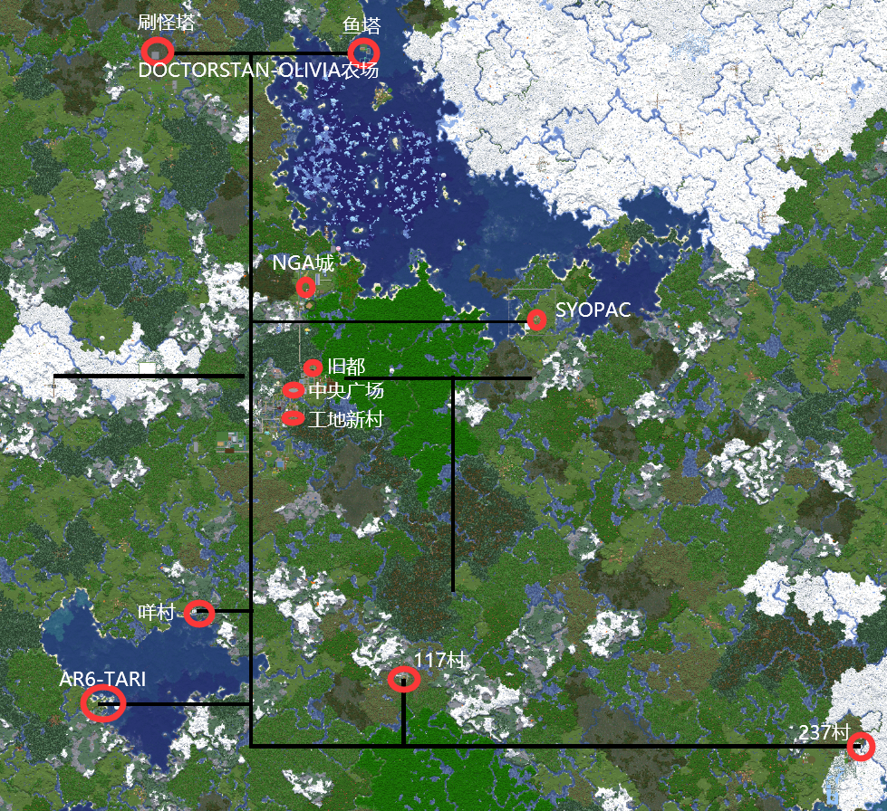
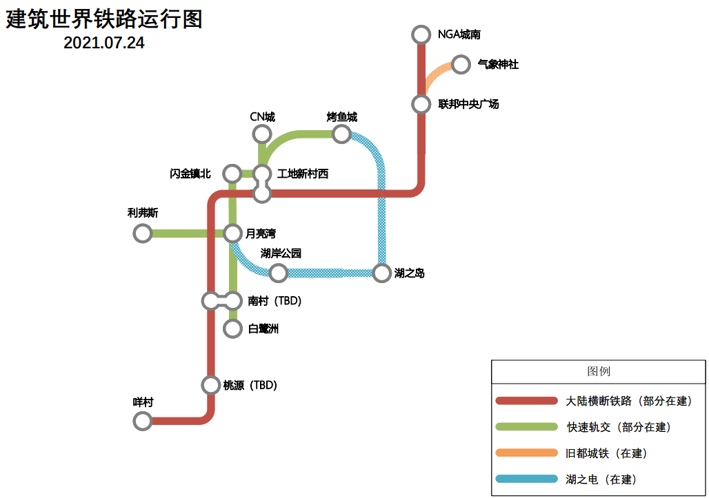
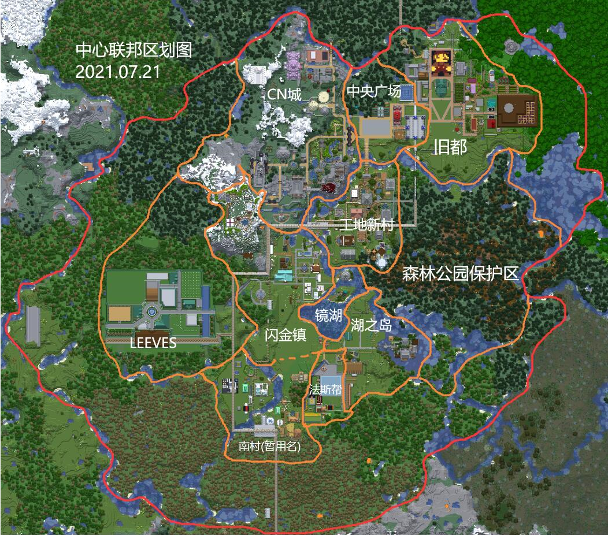

# 当前周目聚居群落介绍

## 建筑世界主要聚居群落分布图（附下界快速路）

从中央广场出发，北部的快速路为 @DoctorStan @Oliviamc 二人修建，南部的快速路为早先管理员修建，
东西部的快速路原为 33 修建，断开情况为历史遗留问题，有条件的时候予以修改后接回。

## 建筑世界铁路运行规划

实心的部分为已开通线路，虚线部分为规划线路。

跨地域的主干线建设标准为双向两车道，以后新修线站逐步实现普及缓冲区间和自动化。

支线建设标准因地制宜，以效率和美观优先。

注意：**中央广场站** 和 **南村站** 的横断铁路线站台均配有缓冲区间，有缓冲区间的车站下车后请不要把车拿走，直接让空车发射自动回收，不然会影响系统对占车位的误判。而无缓冲区间的车站下车后务必要拿走车，以防后来人冲突回弹。

## 中心联邦（暂行名称）图

以下为各区域简介。

### 旧都+中央广场

这个世界最初起点的平原，位处中心联邦的东北部，主要建筑以公共建筑为主，
有怀士堂（在建）、马力欧广场、商店街组合、天气神社（在建）、温泉旅馆、二代公共钓鱼池、工会中心、博物馆、@LB宅、火车站，以及旧33经济开发区的遗址。
后由于旧33区持续发生极大极恶服务器爆卡事件，联邦开发重心转向工地新村为首的环湖区域，旧都逐渐遭到废弃。
日前旧都经过无害化处理已经基本恢复正常，以联邦中央广场为首的新中心基建火热进行中，各项市政工程逐步推进（联邦广场、北门码头、电车线路等）。

区域负责人：@Himayama。

### CN城

CN城在联邦的西北部，被高山环绕，地势险要，以中世纪石城风格为主体风格，由@Noland_CN一手设计实现，是联邦的守备重镇，
内有标志性的城堡、兵营、魔法学院、骑兵像等建筑，并设立了到工地新村的快速电车线路。

区域负责人：@Noland_CN

### 工地新村

工地新村是联邦乃至服务器最繁华、完成度最高的居住区，位处联邦的中心区位，整体建筑风格为木结构为主的田园风，
拥有烤鱼城地标、仰望星空钓鱼台、大教堂、露天温泉、轨道交通工地新村西枢纽站等公共设施以及 @RU1NER @237th @Wanfang @7Bradley @kkamisama @MagicSquare宅基地。
目前正在进行五星级工地村大酒店的建设。

区域负责人：@RU1NER

### 镜湖

镜湖原是工地新村南部的河域，最早由@Aroi圈地造宅，在服务器730重大时光倒流事件发生后，世界线改变了，
河域被人工开挖改变成目前的形状，即镜湖。湖区北部原@Aroi宅的位置上由@RU1NER建设了高达133m的强强石塔，成为联邦的新地标，
而北部小岛出现了来自外域的门，连通上了异次元（资源世界），环绕湖区的工地新村、闪金镇、南村、法斯帮、湖之岛区域则亦统称为环湖居住开发区。

区域负责人：@RU1NER @Himayama

### 闪金镇

闪金镇在镜湖西北部，是连通CN南城、工地新村和LEEVES的路口。730时光倒流后由@Aroi首先登录开发住宅和钓鱼小屋，
而后逐渐入驻了@QQuincy的狮王之傲旅店、@7Bradley的汤姆头和视窗屋、@Flora的雪山庄园、@rryy的狗头房和兔屋、@ru1ner的密室逃脱、@ProSRLee宅，
原商店街也升级为移动巴士和7-11便利店，之后建立了闪金镇地标广场、图书馆、月亮湾花海景区，承办过2021花火大会。

区域负责人：@QQuincy

### 湖之岛町

湖之岛在镜湖东南岸，最早规划为大型马场用地，设计几经更改，最终马场区域改为町的南部，东部则是被自然针叶森林环绕@Himayama的竹苑，
北边是半岛本体，湖边先行建造了糖果茶楼。拟定开发为和式商店街旅游观光区。

区域负责人：@Himayama

### 法斯帮

法斯帮驻地位于马场路隧道西侧的盆地，和跑马场一路相隔，目前有三位成员@Van @Inf404 @mmxii2012的住宅，
代表性建筑有水立方和VAN像，该区域有发达的自动羊毛产业，目前已又又又鸽了好久。

区域负责人：@Van

### 南村(TBD)

联邦新设立的区域，毗邻法斯帮和闪金镇，拥有南村交通枢纽以及@Gabriel_Chen和@ManusErohand的驻地和隔河相望的@kmk4dwty混合风格田园农庄，
正在招商、招人、蓬勃发展中，并寻求更名。

区域负责人：@Himayama托管

### 近郊都市LEEVES

该市在闪金镇西部的森林里开辟而来，原型出自于Falcom《英雄伝説 閃の軌跡III》的同名游戏场景，最初设立背景为替代由于旧33区而爆卡的旧都发挥出生点职能。
在建设完成度过半的时候由于众多新玩家加入服务器、环镜湖开发区开始走向繁荣的新形势下，旧都的出生点职能被取代，
失去了继续投入的意义从而搁置了建设。日后在更高优先度的工程完成之后或有其他合适契机再考虑重启项目。
目前引进了@Syopac负责的服务器分类公共仓库项目，并重新规划了铁路线，逐渐复苏中。

区域负责人。@Himayama

### NGA城

2020年11月，服务器从NGA招募了一批富有活力的新选手加入社区，新选手们联合建造了NGA城，
目前城内有自由贸易区、运河、圣诞鹿广场、刷怪大树、地宫、工业绵羊、红石音乐Maqq公寓以及夸的锚像等，
同时也有@SnowRhex @AsielQ @KOTOKO @Gokou @TkingCat @Misaka @LINWUFENG @visper77 @Maqq @Maotoo @enjing 的民宅，
已联通大陆横断铁道和下界交通。

区域负责人：@SnowRhex

### 工业园区

工业园区位于NGA城西北部，设立宗旨是优化服务器公共资源的生产、储存和分配。目前咕咕中，并且持续咕咕中（）

### 咩村

围绕咩酱在地中海北岸豪宅兴起的新聚落，居民有咩酱、猫猫头、玛、长安和罪等，目前蓬勃发展（咕咕）中。

区域负责人@kikikiranya

### 深海之泪（AR6-TARI-LDFOCEAN基地）

位于地中海南岸，有叹为观止的雕塑。

区域负责人：@Airyou06

### 117村

在服务器开荒伊始加入以@117为首的神秘四人组开发的孤村，现今由于四人组已化为鸽仙，而变为鬼村。

区域负责人：@117

### 237村

在服务器开荒伊始@237th没有选择加入旧都，而是进行1小时直播开荒挑战，选择了村民路线发展。
机缘巧合之下流浪到237村住下帮助当地村民发展族群、振兴经济，村旁步行数十米即有末地传送门，是最初往末地旅行的必经之地。
@Himayama在此处设立了小型火车站和铁道之夜旅馆，村内也秘密收养了熊猫家族和北极熊，而后@237th搬家加入了工地新村，留下了不知所措的当地居民和只有一层的腾讯大厦。

区域负责人：@237th

### DOCTORSTAN-OLIVIAMC农场

联邦北部2km左右位置的大平原处，@DoctorStan和@oliviamc建立了他们的农场、刷怪塔，不远处的海底神殿也被改造为了海底渔场，盛产各类海晶材料和生鱼。是经济型玩家的常去之处。

区域负责人：@DoctorStan @oliviamc

### SYOPAC农场

联邦东部远处海的另一边，有@Syopac开发区和@OldDove1993的铁炉堡建设地，由于这两人长期鸽，这两个地方完成度提升缓慢，人迹罕至。标志性建筑是Syopac的高墙。

区域负责人：@Syopac

### 其他地区

桃园岛、@RU1NER人工湖、@Flora野外庄园 @YibaccZ城 以及某个新的大型聚居市镇都在设计开发中。

